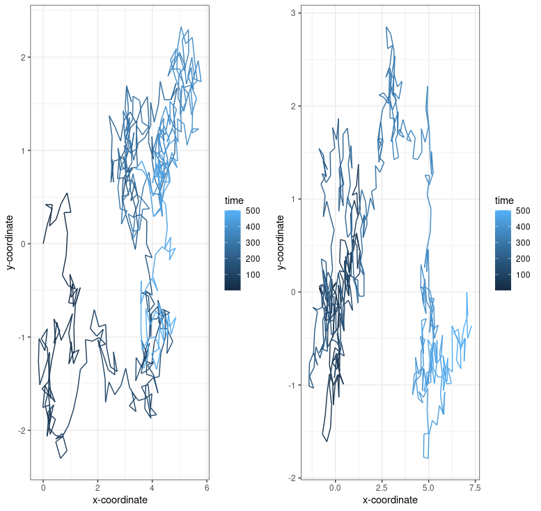
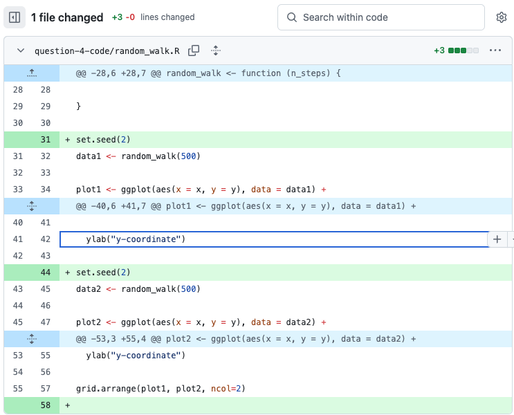
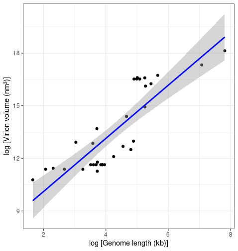

# Reproducible research: version control and R

# INSERT ANSWERS HERE

Questions 1, 2 and 3 can be found here: <https://github.com/Bobyboboboss/logistic_growth.git>

### Question 4:

Sometimes we are interested in modelling a process that involves randomness. A good example is Brownian motion. We will explore how to simulate a random process in a way that it is reproducible:

a)  A script for simulating a random_walk is provided in the `question-4-code` folder of this repo. Execute the code to produce the paths of two random walks. What do you observe? (10 points)

When the code is executed, it produces two independent random walk graphs. Each walk starts at the 0;0 coordinates and is made of 500 steps. The datasets "data1" and "data2" store the coordinates for the two random walks. Each step is 0.25 in length but the angle between these steps is a random number between 0 and 2pi. The random angle between each step causes the difference between the two panels and explains why different plots are created each time the code is executed. Time and therefore step number are shown by the colour gradient with dark blue showing earlier steps and light blue for later ones. The code has no random seed which means the variability solely relies on the random number generation for the angle. This poses issues for reproducibility as a graph can therefore never be reproduced. A solution to this would be creating a random seed which we will explore later.

#### Figure I: Random walk graph



b)  Investigate the term **random seeds**. What is a random seed and how does it work?

A random seed is a number used to initiate a pseudo-random number generation event which in turn produces a series of non-repeating numbers with similar properties to a random series. Therefore, a pseudo-random number generator will produce the same output if given the same seed. This is useful for simulations, experiments or debugging where reproducibility is key.

c\. Edit the script to make a reproducible simulation of Brownian motion. Commit the file and push it to your forked `reproducible-research_homework` repo. (10 points)

In order to make a reproducible simulation of Brownian motion, I used the "set.seed' function. This ensures that the random numbers generated in "random_walk" are identical every time the script is run. As I used the same seed, 2, for both data1 and data2, they produce the same plot at every execution.

d.Go to your commit history and click on the latest commit. Show the edit you made to the code in the comparison view (add this image to the **README.md** of the fork). (5 points)



# Question 5:

In 2014, Cui, Schlub and Holmes published an article in the *Journal of Virology* (doi: <https://doi.org/10.1128/jvi.00362-14>) showing that the size of viral particles, more specifically their volume, could be predicted from their genome size (length). They found that this relationship can be modelled using an allometric equation of the form $`V = \alpha L^{\beta}`$, where $`V`$ is the virion volume in nm<sup>3</sup> and $`L`$ is the genome length in nucleotides.

a)  Import the data for double-stranded DNA (dsDNA) viruses taken from the Supplementary Materials of the original paper into Posit Cloud (the csv file is in the `question-5-data` folder). How many rows and columns does the table have? (3 points)

The table has 13 columns and 33 rows

b)  What transformation can you use to fit a linear model to the data? Apply the transformation. (3 points)

As the original relationship between genome size and virion volume is non-linear, we need to log transform both variables in order to fit a linear model as follows:

$V = \alpha L^{\beta}$

$log(V) = \log(\alpha) + \beta \cdot \log(L)$

We can now fit a linear model to this. The transformation is coded in the Q5_code.R script present in this repository

c)  Find the exponent ($\beta$) and scaling factor ($\alpha$) of the allometric law for dsDNA viruses and write the p-values from the model you obtained, are they statistically significant? Compare the values you found to those shown in **Table 2** of the paper, did you find the same values?

Once the data is log transformed, we can fit a linear model to it and observe the coefficients through the summary () function.

This gives us:

-   An intercept of 7.0748 with a P-value of 2.28e-10 showing statistical significance, but since we applied a log transformation, the α is:

    $α  = exp(7.0748)= 1181.807$

-   Log_L estimate of 1.5152 with a P-value of 6.44e-10 showing statistical significance, this corresponds to the β

For dSDNA viruses, Table 2 of the paper shows a β of 1.52 with a 95% confidence of 1.16 - 1.87. It also shows an α of 1182 with a 95% confidence interval of 246–5675.

These are the same exact values as found in our model (accounting for rounding).

d)  Write the code to reproduce the figure shown below.

Full code is in Q5_code.R, below is the extract coding for the figure:

```{r}
ggplot(data = logdata, aes(x = log_L, y = log_V)) +
  geom_point() +              
  geom_smooth(method = "lm", color = "blue") +
  xlab("log [Genome length (kb)]") +               
  ylab("log [Virion volume (nm³)]") +             
  theme_bw()                                       

```

The code produces this graph which is identical to the original:



e)  What is the estimated volume of a 300 kb dsDNA virus?

We know that:

$V = \alpha L^{\beta}$

α = 1182

β = 1.5152

Therefore when L = 300:

$V = 1182 \cdot 300 ^{1.5152} = 6698100 nm^3$

The estimated volume of a 300 kb dsDNA virus is 6 698 100 nm\^3

## Instructions

The homework for this Computer skills practical is divided into 5 questions for a total of 100 points. First, fork this repo and make sure your fork is made **Public** for marking. Answers should be added to the \# INSERT ANSWERS HERE \# section above in the **README.md** file of your forked repository.

Questions 1, 2 and 3 should be answered in the **README.md** file of the `logistic_growth` repo that you forked during the practical. To answer those questions here, simply include a link to your logistic_growth repo.

**Submission**: Please submit a single **PDF** file with your candidate number (and no other identifying information), and a link to your fork of the `reproducible-research_homework` repo with the completed answers (also make sure that your username has been anonymised). All answers should be on the `main` branch.

## Assignment questions

1)  (**10 points**) Annotate the **README.md** file in your `logistic_growth` repo with more detailed information about the analysis. Add a section on the results and include the estimates for $N_0$, $r$ and $K$ (mention which \*.csv file you used).

2)  (**10 points**) Use your estimates of $N_0$ and $r$ to calculate the population size at $t$ = 4980 min, assuming that the population grows exponentially. How does it compare to the population size predicted under logistic growth?

3)  (**20 points**) Add an R script to your repository that makes a graph comparing the exponential and logistic growth curves (using the same parameter estimates you found). Upload this graph to your repo and include it in the **README.md** file so it can be viewed in the repo homepage.

4)  (**30 points**) Sometimes we are interested in modelling a process that involves randomness. A good example is Brownian motion. We will explore how to simulate a random process in a way that it is reproducible:

    a)  A script for simulating a random_walk is provided in the `question-4-code` folder of this repo. Execute the code to produce the paths of two random walks. What do you observe? (10 points)\
    b)  Investigate the term **random seeds**. What is a random seed and how does it work? (5 points)\
    c)  Edit the script to make a reproducible simulation of Brownian motion. Commit the file and push it to your forked `reproducible-research_homework` repo. (10 points)\
    d)  Go to your commit history and click on the latest commit. Show the edit you made to the code in the comparison view (add this image to the **README.md** of the fork). (5 points)

5)  (**30 points**) In 2014, Cui, Schlub and Holmes published an article in the *Journal of Virology* (doi: <https://doi.org/10.1128/jvi.00362-14>) showing that the size of viral particles, more specifically their volume, could be predicted from their genome size (length). They found that this relationship can be modelled using an allometric equation of the form $`V = \alpha L^{\beta}`$, where $`V`$ is the virion volume in nm<sup>3</sup> and $`L`$ is the genome length in nucleotides.

    a)  Import the data for double-stranded DNA (dsDNA) viruses taken from the Supplementary Materials of the original paper into Posit Cloud (the csv file is in the `question-5-data` folder). How many rows and columns does the table have? (3 points)\
    b)  What transformation can you use to fit a linear model to the data? Apply the transformation. (3 points)\
    c)  Find the exponent ($\beta$) and scaling factor ($\alpha$) of the allometric law for dsDNA viruses and write the p-values from the model you obtained, are they statistically significant? Compare the values you found to those shown in **Table 2** of the paper, did you find the same values? (10 points)\
    d)  Write the code to reproduce the figure shown below. (10 points)

<p align="center">


</p>

e)  What is the estimated volume of a 300 kb dsDNA virus? (4 points)
